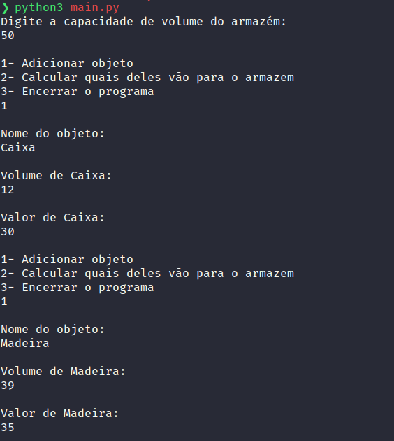
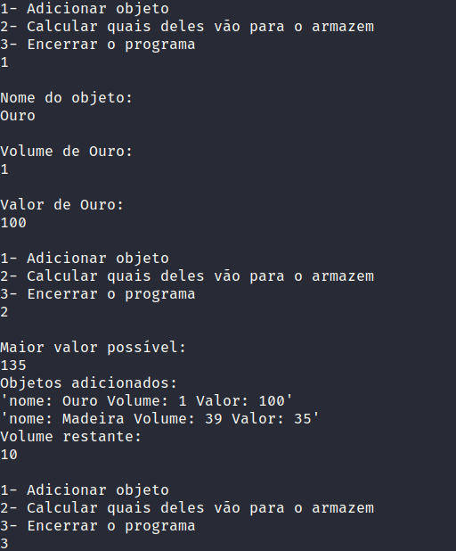
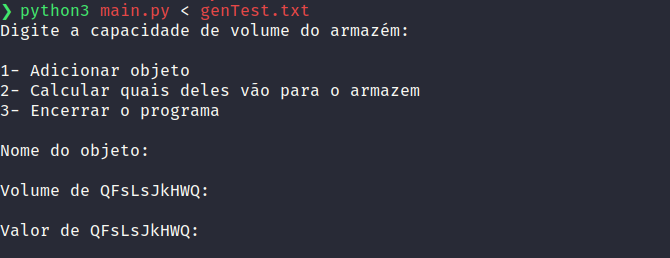
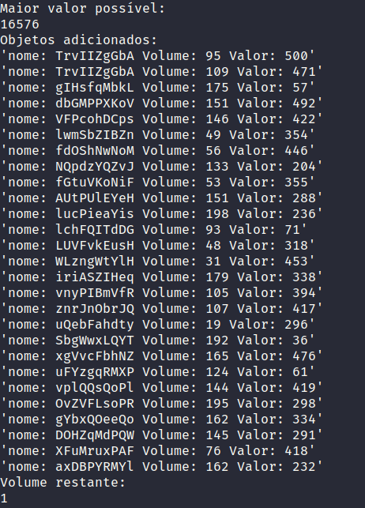

# Armazem

## O que é o nosso projeto?

O nosso projeto calcula qual o maior valor que pode ser armazenado em um armazem com espaço limitado, indicando ao usuário quais são esses itens, além do volume restante.

## Membros:

| Nome                          | Github         | Matrícula  |
| ----------------------------- | -------------- | ---------- |
| Kathlyn Lara Murussi          | @klmurussi     | 18/0042378 |
| Júlio César Schneider Martins | @jschneiderm98 | 16/0032903 |

## Screenshots

### Exemplo de preenchimento a partir do terminal

### Exemplo de resultado do preenchimento a partir do terminal

### Exemplo de preenchimento utilizando txt gerado pelo gerador de testes

### Exemplo de resultado do preenchimento utilizando txt gerado pelo gerador de testes

## Vídeo da dupla

